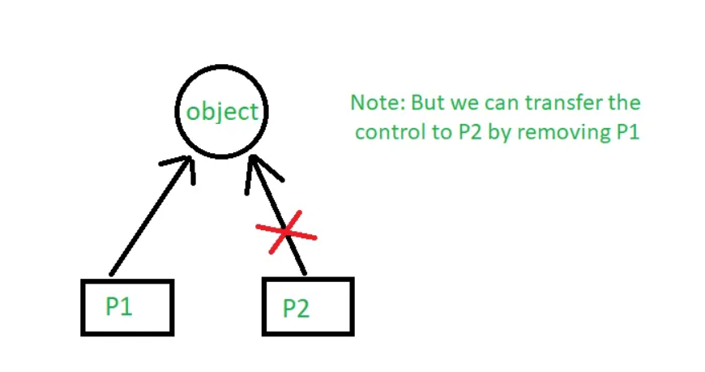
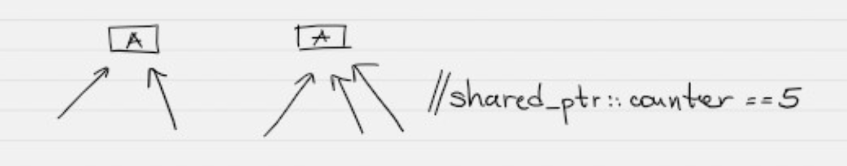
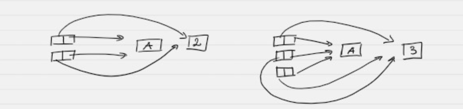
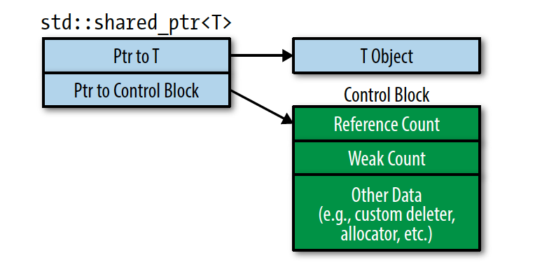
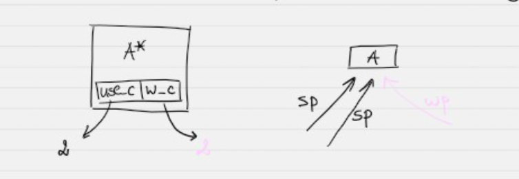
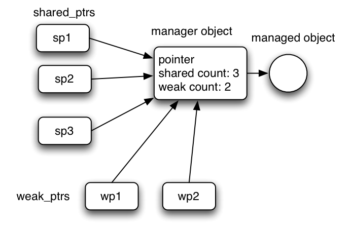

# Rule of Zero, STL Контейнери и Умни Указатели в C++

---

## Съдържание

1. [Проблемът с ръчното управление на памет](#1-проблемът-с-ръчното-управление-на-памет)
2. [std::string](#2-stdstring)
3. [std::vector](#3-stdvector)
4. [Готови алгоритми от `<algorithm>`](#35-готови-алгоритми-от-algorithm)
5. [Rule of Zero](#4-rule-of-zero)
6. [std::pair](#45-stdpair)
7. [std::optional (C++17)](#46-stdoptional-c17)
8. [Умни указатели — какво са?](#5-умни-указатели--какво-са)
9. [std::unique\_ptr](#6-stdunique_ptr)
10. [std::shared\_ptr](#7-stdshared_ptr)
11. [std::weak\_ptr](#8-stdweak_ptr)
12. [unique\_ptr vs shared\_ptr — кога се използва кое?](#9-unique_ptr-vs-shared_ptr--кога-се-използва-кое)
13. [Edge Cases и капани](#10-edge-cases-и-капани)
14. [Обобщение](#11-обобщение)

---

## Основни дефиниции

> **RAII** (Resource Acquisition Is Initialization) — ресурсът се заделя в конструктора и се освобождава в деструктора. Деструкторът се извиква автоматично — дори при изключения.

> **Ownership (собственост)** — кой обект е отговорен за живота на даден ресурс. Кой трябва да го освободи.

> **Smart pointer** — клас, който обвива суров указател и управлява живота на обекта автоматично чрез RAII.

> **Rule of Zero** — клас, чиито член-данни сами управляват ресурсите си (чрез `std::string`, `std::vector`, `unique_ptr` и т.н.), не трябва да дефинира нито един от специалните методи(Copy Constructor, Op=, Move Constuctor, Move Op=) — компилаторът ги генерира правилно автоматично.

> **Reference counting** — механизъм, при който се брои колко указателя сочат към даден обект в Heap-a. При нула — обектът се унищожава.

---

## 1. Проблемът с ръчното управление на памет

Всяко `new` изисква точно едно съответно `delete`. На практика това е трудно да се гарантира:

```cpp
void riskyFunction() {
    int* p = new int(42);

    if (someCondition())
        return;          // ❌ p никога не се изтрива — memory leak!

    doSomethingThatThrows();  // ❌ изключение → p не се изтрива

    delete p;            // стига ли се тук?
}
```

Проблемите с ръчното `new`/`delete`:

```
❌ Memory leak     — забравено delete → паметта не се освобождава
❌ Double delete   — delete на вече изтрит указател → crash
❌ Dangling pointer— използване на указател след delete → undefined behavior
❌ Неясна ownership— кой трябва да извика delete?
```

**Решението:** STL класове и smart pointers, които прилагат RAII — деструкторът освобождава ресурса автоматично, независимо от пътя на изпълнение.

---

## 2. `std::string`

`std::string` е STL клас за управление на текстови низове. Вътрешно управлява динамична памет, но не изисква ръчно `new`/`delete`.

### Защо вместо `char*`?

```cpp
// ❌ Стар начин с char* — ръчна памет, ръчно копиране:
char* name = new char[50];
strcpy(name, "Иван");
// ... трябва да се помни delete[] накрая

// ✅ Модерен начин:
std::string name = "Иван";
// управлява паметта автоматично
```

### Създаване

```cpp
std::string s1;                      // празен стринг ""
std::string s2 = "hello";           // от C-style стринг
std::string s3("world");            // конструктор
std::string s4(5, 'x');             // "xxxxx" — 5 пъти символа 'x'
std::string s5 = s2;                // копиране
```

### Основни операции

```cpp
std::string s = "hello";

s.size();          // 5 — брой символи
s.length();        // 5 — еквивалентно на size()
s.empty();         // false
s.clear();         // изчиства съдържанието → ""

s += " world";     // конкатенация: "hello world"
s = s + "!";       // конкатенация с нов обект

s[0];              // 'h' — без проверка на граници
s.at(0);           // 'h' — с проверка, хвърля std::out_of_range

s.front();         // 'h' — първи символ
s.back();          // '!' — последен символ

s.substr(6, 5);    // "world" — подстринг от позиция 6, дължина 5
s.find("world");   // 6 — позицията, или std::string::npos ако не е намерено

const char* cs = s.c_str();   // C-style представяне (null-terminated)
```

### Сравнение

```cpp
std::string a = "apple";
std::string b = "banana";

a == b;    // false
a < b;     // true — лексикографско сравнение
a != b;    // true
```

### `std::string` и Rule of Zero

`std::string` сам управлява паметта си — всеки клас, съдържащ само `std::string` като член, **не се нуждае от Голяма Шестица**:

```cpp
class Person {
    std::string name;  // std::string управлява паметта
    int age;
public:
    Person(const std::string& n, int a) : name(n), age(a) {}
    // Деструктор, копиращ конструктор, operator= —
    // всичките се генерират правилно от компилатора!
};
```

---

## 3. `std::vector`

`std::vector<T>` е динамичен масив — расте автоматично при нужда, управлява паметта сам.

### Вътрешна структура

Вътрешно `std::vector` пази три указателя:

```
┌──────────────────────────────────────────────────┐
│  begin_    → начало на заделената памет           │
│  end_      → след последния елемент (size)        │
│  cap_end_  → край на заделената памет (capacity)  │
└──────────────────────────────────────────────────┘

begin_     end_      cap_end_
  │          │           │
  ▼          ▼           ▼
 [1][2][3][4][_][_][_][_]
  ←  size=4  → ← свободно →
  ←────── capacity=8 ──────→
```

`size` — брой елементи. `capacity` — максималният брой без реалокация.

### Създаване

```cpp
std::vector<int> v1;                    // празен
std::vector<int> v2(5);                // 5 елемента, всички 0
std::vector<int> v3(5, 42);            // 5 елемента, всички 42
std::vector<int> v4 = {1, 2, 3, 4};   // инициализация
std::vector<int> v5 = v4;             // копиране
```

### Добавяне и премахване

```cpp
std::vector<int> v;
v.push_back(10);   // добавя в края
v.push_back(20);
v.push_back(30);   // v = {10, 20, 30}

v.pop_back();      // маха последния → v = {10, 20}
v.clear();         // маха всичко → v = {}
```

### Достъп до елементи

```cpp
std::vector<int> v = {10, 20, 30};

v[0];              // 10 — без проверка (бърз достъп)
v.at(0);           // 10 — с проверка, хвърля std::out_of_range
v.front();         // 10 — първи
v.back();          // 30 — последен
```

### Размер и капацитет

```cpp
v.size();          // брой елементи
v.capacity();      // заделена памет
v.empty();         // дали е празен

v.reserve(100);    // заделя памет за 100 без да добавя елементи
v.resize(5);       // разширява/съкращава — добавя 0 при разширяване
```

### Реалокация — важно!

При `push_back`, ако `size == capacity`, векторът:
1. Заделя **нов**, по-голям блок памет (обикновено удвоява)
2. **Мести** елементите (или ги копира ако няма move constructor)
3. Освобождава стария блок

```cpp
std::vector<int> v;
v.reserve(3);   // capacity=3, size=0

int* ptr = &v[0];       // ❌ Опасно! Адресът може да се смени при реалокация

v.push_back(1);
v.push_back(2);
v.push_back(3);
v.push_back(4);   // реалокация! ptr вече е висящ указател

// ptr сочи към стара, освободена памет → undefined behavior!
```

### Обхождане

```cpp
std::vector<int> v = {1, 2, 3, 4, 5};

// Range-based for (препоръчан)
for (const auto& x : v)
    std::cout << x << " ";

// С индекс
for (int i = 0; i < v.size(); i++)
    std::cout << v[i] << " ";

// С итератор
for (auto it = v.begin(); it != v.end(); ++it)
    std::cout << *it << " ";
```

### `std::vector` с обекти

```cpp
struct Student {
    std::string name;
    double grade;
};

std::vector<Student> students;
students.push_back({"Иван",  5.5});
students.push_back({"Мария", 6.0});
students.push_back({"Петър", 4.0});

for (const auto& s : students)
    std::cout << s.name << " → " << s.grade << "\n";
```

### Кога НЕ е подходящ `std::vector`?

```
✅ Подходящ за:      бърза итерация, добавяне в края, случаен достъп
❌ Неподходящ за:    чести вмъквания в средата/началото (O(n))
                    нужда от стабилни адреси на елементите
```
## 3.5. Готови алгоритми от `<algorithm>`
 
STL предоставя готови алгоритми, които работят върху всеки контейнер чрез итератори. Алгоритмите не знаят нищо за контейнера — работят единствено чрез `begin()` и `end()`.
 
```cpp
#include <algorithm>
```
 
### `std::sort` — сортиране
 
Сортира елементите в диапазона `[first, last)`. Изисква **random access итератори** (работи с `std::vector` и масиви, не с `std::list`).
 
```cpp
std::vector<int> v = {5, 2, 8, 1, 9, 3};
 
// По нарастване (по подразбиране)
std::sort(v.begin(), v.end());
// v = {1, 2, 3, 5, 8, 9}
 
// По намаляване
std::sort(v.begin(), v.end(), std::greater<int>());
// v = {9, 8, 5, 3, 2, 1}
 
// С ламбда — по потребителски критерий
std::vector<Student> students = {{"Петър", 4.0}, {"Иван", 5.5}, {"Мария", 6.0}};
 
std::sort(students.begin(), students.end(),
    [](const Student& a, const Student& b) {
        return a.grade < b.grade;   // по оценка нарастващо
    });
// Петър(4.0), Иван(5.5), Мария(6.0)
```
 
### `std::stable_sort` — сортиране с запазен ред на равни елементи
 
Работи като `std::sort`, но **запазва относителния ред** на елементи с еднаква стойност. Малко по-бавен от `std::sort`.
 
```cpp
std::vector<Student> students = {
    {"Иван",   5.5},
    {"Мария",  6.0},
    {"Петър",  5.5},   // същата оценка като Иван
    {"Анна",   6.0}    // същата оценка като Мария
};
 
// std::sort може да размени Иван и Петър (и двамата 5.5)
std::sort(students.begin(), students.end(),
    [](const Student& a, const Student& b) { return a.grade < b.grade; });
 
// std::stable_sort ГАРАНТИРА: Иван е преди Петър, Мария е преди Анна
std::stable_sort(students.begin(), students.end(),
    [](const Student& a, const Student& b) { return a.grade < b.grade; });
// Иван(5.5), Петър(5.5), Мария(6.0), Анна(6.0)
```
 
**Кога да използваш `stable_sort` вместо `sort`:**
- При обекти, равни по един критерий, но различни по друг
- Когато сортираш на няколко пъти по различни критерии и искаш да запазиш предишния ред
 
### `std::find` — търсене на стойност
 
Търси **първото срещане** на стойност. Връща итератор — ако не е намерено, връща `end()`.
 
```cpp
std::vector<int> v = {1, 5, 3, 8, 2, 7};
 
auto it = std::find(v.begin(), v.end(), 8);
 
if (it != v.end()) {
    std::cout << "Намерено: " << *it << "\n";              // 8
    std::cout << "На позиция: " << (it - v.begin()) << "\n"; // 3
} else {
    std::cout << "Не е намерено\n";
}
```
 
### `std::find_if` — търсене по условие
 
Търси първия елемент, за който дадено условие (предикат) е вярно.
 
```cpp
std::vector<int> v = {1, 5, 3, 8, 2, 7};
 
// Намери първото число > 6
auto it = std::find_if(v.begin(), v.end(), [](int x) {
    return x > 6;
});
 
if (it != v.end())
    std::cout << *it << "\n";   // 8
 
// Намери студент с оценка >= 5.5
std::vector<Student> students = {{"Петър", 4.0}, {"Иван", 5.5}, {"Мария", 6.0}};
 
auto s = std::find_if(students.begin(), students.end(),
    [](const Student& st) { return st.grade >= 5.5; });
 
if (s != students.end())
    std::cout << s->name << "\n";   // Иван
```
 
### `std::transform` — трансформиране на елементи
 
Прилага функция върху всеки елемент и записва резултата в друг диапазон (може да е същия).
 
```cpp
std::vector<int> v = {1, 2, 3, 4, 5};
std::vector<int> result(v.size());
 
// Удвоява всеки елемент и записва в result
std::transform(v.begin(), v.end(), result.begin(),
    [](int x) { return x * 2; });
// result = {2, 4, 6, 8, 10}
 
// Промяна "на място" — записваме в същия вектор
std::transform(v.begin(), v.end(), v.begin(),
    [](int x) { return x * x; });
// v = {1, 4, 9, 16, 25}
 
// Трансформация на обекти — извлича имената на студентите
std::vector<Student> students = {{"Иван", 5.5}, {"Мария", 6.0}};
std::vector<std::string> names(students.size());
 
std::transform(students.begin(), students.end(), names.begin(),
    [](const Student& s) { return s.name; });
// names = {"Иван", "Мария"}
```
 
### Други полезни алгоритми
 
```cpp
// std::count — брои срещания на стойност
int cnt = std::count(v.begin(), v.end(), 5);
 
// std::count_if — брои по условие
int big = std::count_if(v.begin(), v.end(), [](int x) { return x > 3; });
 
// std::all_of / std::any_of / std::none_of — проверки
bool allPositive = std::all_of(v.begin(), v.end(), [](int x) { return x > 0; });
bool anyBig     = std::any_of(v.begin(), v.end(), [](int x) { return x > 10; });
 
// std::reverse — обръща реда
std::reverse(v.begin(), v.end());
 
// std::min_element / std::max_element — намиране на min/max
auto minIt = std::min_element(v.begin(), v.end());
auto maxIt = std::max_element(v.begin(), v.end());
std::cout << *minIt << " " << *maxIt << "\n";
 
// std::fill — запълва с дадена стойност
std::fill(v.begin(), v.end(), 0);   // всички → 0
 
// std::copy — копира в друг контейнер
std::vector<int> dest(v.size());
std::copy(v.begin(), v.end(), dest.begin());
```
 
### Принципът — алгоритмите не знаят за контейнера
 
```cpp
std::vector<int> vec  = {3, 1, 4, 1, 5};
std::array<int, 5> arr = {3, 1, 4, 1, 5};
int raw[] = {3, 1, 4, 1, 5};
 
// Един и същ алгоритъм работи с всички:
std::sort(vec.begin(),  vec.end());
std::sort(arr.begin(),  arr.end());
std::sort(std::begin(raw), std::end(raw));
```

---

## 4. Rule of Zero

### Проблемът с ръчното управление

Клас с `char*` изисква Голяма Шестица — много код, много потенциал за грешки:

```cpp
class Person {
    char* name;   // ← ръчна памет
    int   age;
public:
    Person(const char* n, int a) { /* new */ }
    Person(const Person& other)  { /* copyFrom */ }
    Person& operator=(...)       { /* free + copyFrom */ }
    ~Person()                    { /* delete[] */ }
};
```

### Решението — Rule of Zero

Ако член-данните сами управляват ресурсите (`std::string`, `std::vector`, smart pointers), **компилаторът генерира всички специални функции правилно** — не трябва да се пишат ръчно.

```cpp
// ✅ Rule of Zero — без нито един специален метод:
class Person {
    std::string           name;    // управлява своята памет
    int                   age;
    std::vector<double>   grades;  // управлява своята памет
public:
    Person(std::string n, int a, std::vector<double> g)
        : name(std::move(n)), age(a), grades(std::move(g)) {}

    // Деструктор        → генериран от компилатора ✅
    // Copy конструктор  → генериран от компилатора ✅
    // Copy operator=    → генериран от компилатора ✅
    // Move конструктор  → генериран от компилатора ✅
    // Move operator=    → генериран от компилатора ✅

    double averageGrade() const {
        if (grades.empty()) return 0.0;
        double sum = 0;
        for (double g : grades) sum += g;
        return sum / grades.size();
    }

    void print() const {
        std::cout << name << " (age " << age
                  << ") — avg: " << averageGrade() << "\n";
    }
};

int main() {
    Person p1("Иван", 20, {5.5, 6.0, 4.5});
    Person p2 = p1;        // ✅ копира правилно — deep copy!
    Person p3 = std::move(p1);  // ✅ мести правилно

    p2.print();
    p3.print();
}
```

### Rule of Zero vs. Rule of Five

```
Rule of Five:
  → При ръчна динамична памет (char*, int*)
  → Трябва ръчно: деструктор, copy ctor, copy op=, move ctor, move op=
  → Повече код, повече потенциални грешки

Rule of Zero:
  → При std::string, std::vector, unique_ptr като членове
  → Компилаторът генерира всичко правилно
  → По-малко код, по-безопасен, по-лесен за поддръжка
```

### Кога е невъзможен Rule of Zero?

Когато класът директно управлява нестандартен ресурс — файлов дескриптор, мрежова връзка, mutex. Тогава трябва Rule of Five.

---

## 4.5. `std::pair`

### Какво е?

`std::pair<T1, T2>` е прост контейнер за **точно два свързани обекта** от потенциално различни типове. Намества се в `<utility>`, но обикновено се включва автоматично.

```cpp
#include <utility>

std::pair<std::string, int> p = {"Иван", 20};

std::cout << p.first  << "\n";   // Иван
std::cout << p.second << "\n";   // 20
```

### Създаване

```cpp
// Начин 1 — директно:
std::pair<std::string, double> student = {"Мария", 5.75};

// Начин 2 — make_pair (изважда типовете автоматично):
auto result = std::make_pair("Петър", 4.50);

// Начин 3 — с auto и brace initialization (C++17):
std::pair<std::string, int> p = {"Тест", 42};
```

### Достъп

```cpp
std::pair<std::string, int> p = {"Рекс", 3};

p.first;    // "Рекс"  — първият елемент
p.second;   // 3       — вторият елемент

// С structured bindings (C++17) — по-четимо:
auto [name, age] = p;
std::cout << name << " е на " << age << " години\n";
```

### Типични употреби

```cpp
// 1. Функция, която връща два резултата:
std::pair<bool, std::string> tryLogin(const std::string& user) {
    if (user == "admin")
        return {true, "Добре дошъл, admin!"};
    return {false, "Непознат потребител"};
}

auto [success, message] = tryLogin("admin");
if (success) std::cout << message << "\n";

// 2. Ключ-стойност при работа с map:
std::map<std::string, int> grades;
grades.insert(std::make_pair("Иван", 6));

for (const auto& [name, grade] : grades)
    std::cout << name << ": " << grade << "\n";

// 3. Връщане на min и max едновременно:
std::pair<int, int> minMax(const std::vector<int>& v) {
    int mn = v[0], mx = v[0];
    for (int x : v) {
        if (x < mn) mn = x;
        if (x > mx) mx = x;
    }
    return {mn, mx};
}

auto [mn, mx] = minMax({3, 1, 4, 1, 5, 9});
std::cout << "min=" << mn << " max=" << mx << "\n";  // min=1 max=9
```

### Сравнение

`pair` поддържа сравнение лексикографски — първо по `first`, при равенство по `second`:

```cpp
std::pair<int, int> a = {1, 5};
std::pair<int, int> b = {1, 3};
std::pair<int, int> c = {2, 0};

std::cout << (a > b) << "\n";   // true  — first е равно, 5 > 3
std::cout << (a < c) << "\n";   // true  — 1 < 2
```

### Кога се ползва

```
✅ Функция трябва да върне два резултата
✅ Ключ-стойност двойки (std::map вътрешно ползва pair)
✅ Временна група от два свързани обекта

❌ Три и повече стойности → std::tuple
❌ Семантично значими данни → напиши собствен struct с имена
```

---

## 4.6. `std::optional` (C++17)

### Какво е?

`std::optional<T>` представя стойност, която **може да съществува или да липсва**. Алтернатива на `nullptr`, магически стойности (`-1`, `""`) и отделни `bool` флагове.

```cpp
#include <optional>

std::optional<int> намери(const std::string& name) {
    if (name == "Иван") return 20;    // съдържа стойност
    return std::nullopt;               // не съдържа нищо
}
```

### Основна употреба

```cpp
auto result = намери("Иван");

// Проверка дали съдържа стойност:
if (result.has_value())
    std::cout << result.value() << "\n";

// По-кратко с operator bool:
if (result)
    std::cout << *result << "\n";

// Стойност по подразбиране ако е nullopt:
int age = result.value_or(0);
```

### Сравнение с алтернативите

```cpp
// ❌ Стар начин 1 — магическа стойност:
int findAge(const std::string& name) {
    if (name == "Иван") return 20;
    return -1;   // -1 означава "не е намерено" — неясно и опасно
}
// Какво ако -1 е валидна стойност?

// ❌ Стар начин 2 — изходен bool параметър:
int findAge(const std::string& name, bool& found) {
    if (name == "Иван") { found = true; return 20; }
    found = false; return 0;
}
// Неудобен синтаксис, лесно се забравя проверката

// ✅ С optional — ясно и безопасно:
std::optional<int> findAge(const std::string& name) {
    if (name == "Иван") return 20;
    return std::nullopt;
}
```

### Достъп до полета с `->`

```cpp
struct Student {
    std::string name;
    double      grade;
};

std::optional<Student> find(const std::string& n) {
    if (n == "Иван") return Student{"Иван", 5.5};
    return std::nullopt;
}

auto s = find("Иван");
if (s) {
    std::cout << s->name  << "\n";   // Иван     ← operator->
    std::cout << s->grade << "\n";   // 5.5
}
```

### Optional поле в клас — Rule of Zero

```cpp
class Patient {
    std::string            name;
    std::string            egn;
    std::optional<std::string> diagnosis;   // може да няма диагноза още

public:
    Patient(const std::string& n, const std::string& e)
        : name(n), egn(e) {}

    void setDiagnosis(const std::string& d) { diagnosis = d; }

    void print() const {
        std::cout << name;
        if (diagnosis)
            std::cout << " — " << *diagnosis;
        else
            std::cout << " — без диагноза";
        std::cout << "\n";
    }

    // Rule of Zero — optional управлява паметта сам
};

Patient p1("Иван", "1234567890");
Patient p2("Мария", "0987654321");
p2.setDiagnosis("Хипертония");

p1.print();   // Иван — без диагноза
p2.print();   // Мария — Хипертония
```

### `pair` + `optional` заедно

```cpp
// Функция, която може да не намери резултат и ако намери — връща двойка:
std::optional<std::pair<std::string, int>> findStudent(int id) {
    if (id == 1) return std::make_pair("Иван", 6);
    if (id == 2) return std::make_pair("Мария", 5);
    return std::nullopt;
}

if (auto s = findStudent(1)) {
    auto [name, grade] = *s;
    std::cout << name << ": " << grade << "\n";   // Иван: 6
}

if (!findStudent(99))
    std::cout << "Студентът не е намерен\n";
```

### Edge case — достъп без проверка

```cpp
std::optional<int> opt = std::nullopt;

opt.value();  // ❌ хвърля std::bad_optional_access!
*opt;         // ❌ undefined behavior

// ✅ Винаги проверявай преди достъп:
if (opt) std::cout << *opt;
std::cout << opt.value_or(0);
```

### Кога се ползва

```
✅ Функция, която може да не намери резултат (търсене)
✅ Optional поле в клас (може да липсва)
✅ Параметър, който е незадължителен
✅ Замества nullptr, -1, "", false флагове

❌ При грешки с причина → std::expected (C++23)
❌ Ownership → std::unique_ptr
❌ Колекция → празен вектор
```

---

## 5. Умни указатели — какво са?

`int* p = new int(42); delete p;` — ако `delete` се пропусне, паметта изтича. Ако се извика два пъти — crash.

**Smart pointer** е клас, който обвива суров указател и прилага RAII:

```cpp
{
    std::unique_ptr<int> p = std::make_unique<int>(42);
    // работим с *p
}   // ← деструкторът на unique_ptr извиква delete автоматично!
    //    дори при изключение!
```

Три вида умни указатели с различен ownership модел:

```
std::unique_ptr  → ЕДИН собственик       (не се копира, само се мести)
std::shared_ptr  → МНОГО собственици     (reference counting)
std::weak_ptr    → НУЛА собственост      (наблюдава, не притежава)
```

---

## 6. `std::unique_ptr`

### Какво е?

`std::unique_ptr<T>` реализира **ексклузивна собственост** — в даден момент точно **един** `unique_ptr` притежава обекта. Когато той излезе от обхват, обектът се унищожава автоматично.

```
    unique_ptr<A>
    ┌───────────┐
    │  ptr ─────┼──→  [ A обект ]
    └───────────┘
    Само един собственик.
    При унищожаване → delete автоматично.
```

### Създаване — винаги с `make_unique`

```cpp
#include <memory>

// ✅ Правилен начин:
auto p = std::make_unique<int>(42);
auto obj = std::make_unique<Student>("Иван", 20);

// ⚠️ Работи, но не се препоръчва:
std::unique_ptr<int> p2(new int(42));
```

`make_unique` е по-безопасен — при изключение между `new` и инициализацията на `unique_ptr`, паметта пак се освобождава.

### Забранено копиране, разрешено преместване

```cpp
auto p1 = std::make_unique<int>(5);

auto p2 = p1;              // ❌ ГРЕШКА: копирането е забранено!
auto p3 = std::move(p1);   // ✅ прехвърля собствеността

// След move:
// p1 == nullptr (вече не притежава нищо)
// p3 притежава обекта
```

Визуализация:

```
Преди move:
  p1 ──→ [5]    p3 = nullptr

След move:
  p1 = nullptr   p3 ──→ [5]
```



### Употреба

```cpp
auto p = std::make_unique<Student>("Иван", 20);

p->print();                  // достъп с ->
(*p).print();                // достъп с *

if (p) { /* p не е nullptr */ }

Student* raw = p.get();      // суров указател, без да дава ownership
p.reset();                   // унищожава обекта, p = nullptr
p.reset(new Student("Мария", 21));  // унищожава стария, заема нов

Student* released = p.release();  // p = nullptr, raw pointer без управление
// ⚠️ released трябва ръчно да се изтрие!
delete released;
```

### `unique_ptr` за масиви

```cpp
auto arr = std::make_unique<int[]>(10);  // масив от 10 int-а

for (int i = 0; i < 10; i++)
    arr[i] = i * i;

// delete[] се вика автоматично
```

### Пример с клас

```cpp
class Engine {
    int horsepower;
public:
    explicit Engine(int hp) : horsepower(hp) {
        std::cout << "Engine(" << hp << ") създаден\n";
    }
    ~Engine() { std::cout << "Engine унищожен\n"; }
    void start() { std::cout << "Engine " << horsepower << "hp стартира\n"; }
};

class Car {
    std::string              brand;
    std::unique_ptr<Engine>  engine;  // Car притежава Engine

public:
    Car(const std::string& b, int hp)
        : brand(b), engine(std::make_unique<Engine>(hp)) {}

    void drive() {
        engine->start();
        std::cout << brand << " шофира\n";
    }
    // Деструкторът не се пише! unique_ptr се грижи автоматично.
};

int main() {
    Car bmw("BMW", 300);
    bmw.drive();
}
// Изход:
// Engine(300) създаден
// Engine 300hp стартира
// BMW шофира
// Engine унищожен   ← автоматично при края на main()
```

### Методи на `unique_ptr`

| Метод | Описание |
|---|---|
| `get()` | Връща суровия указател без да дава ownership |
| `release()` | Освобождава ownership, връща суров указател (не изтрива!) |
| `reset()` | Изтрива паммета в Heap-a (Унищожава обекта), може да приеме нов |
| `*` / `->` | Дереференциране |
| `operator bool` | `true` ако не е `nullptr` |
| `swap(other)` | Разменя с друг `unique_ptr` |

---

## 7. `std::shared_ptr`

### Какво е?

`std::shared_ptr<T>` реализира **споделена собственост** — **много** `shared_ptr`-а могат да сочат към един обект. Обектът се унищожава когато **последният** собственик изчезне.

Механизмът е **reference counting** (броене на референции):

```
Всеки нов shared_ptr → брояч++
Унищожаване на shared_ptr → брояч--
Брояч == 0 → обектът се унищожава
```





### Control Block (управляващ блок)

`shared_ptr` вътрешно съдържа **два** указателя:

```


std::shared_ptr<T>:
┌───────────────────┐
│  ptr → T object   │──────────────→  [ T обект ]
│  ctrl block ptr   │──┐
└───────────────────┘  │
                       ▼
              ┌─────────────────────┐
              │  Reference Count: 3 │  ← брой shared_ptr-и
              │  Weak Count: 2      │  ← брой weak_ptr-и
              │  (custom deleter)   │
              └─────────────────────┘
```

### На картинка:


Контролният блок е **отделна заделена памет**, споделена между всички `shared_ptr`-и към един и същ обект.

### Създаване — винаги с `make_shared`

```cpp
// ✅ Препоръчително — само 1 алокация (обект + control block заедно):
auto p = std::make_shared<int>(42);
auto obj = std::make_shared<Student>("Иван", 20);

// ⚠️ Работи, но 2 алокации (по-бавно):
std::shared_ptr<int> p2(new int(42));
```

| | `make_shared` | `shared_ptr(new T)` |
|---|---|---|
| Алокации | 1 | 2 |
| Производителност | По-бърза | По-бавна |
| Exception safety | ✅ | ❌ |

### Споделяне — копирането увеличава брояча

```cpp
struct Resource {
    Resource()  { std::cout << "Създаден\n"; }
    ~Resource() { std::cout << "Унищожен\n"; }
};

int main() {
    auto p1 = std::make_shared<Resource>();
    std::cout << "Count: " << p1.use_count() << "\n";  // 1

    {
        auto p2 = p1;   // копиране → брояч++
        auto p3 = p1;   // копиране → брояч++
        std::cout << "Count: " << p1.use_count() << "\n";  // 3
    }   // p2 и p3 излизат → брояч--, после пак --

    std::cout << "Count: " << p1.use_count() << "\n";  // 1
}   // p1 излиза → брояч = 0 → обектът се унищожава
```

```
Създаден
Count: 1
Count: 3
Count: 1
Унищожен
```

### Проблемът — циклични зависимости

Ако два обекта се сочат взаимно чрез `shared_ptr`, **брояча никога не стига 0** → memory leak:

```cpp
struct B;   // forward declaration

struct A {
    std::shared_ptr<B> b;
    ~A() { std::cout << "~A\n"; }
};

struct B {
    std::shared_ptr<A> a;
    ~B() { std::cout << "~B\n"; }
};

int main() {
    auto a = std::make_shared<A>();
    auto b = std::make_shared<B>();

    a->b = b;   // b's count: 2
    b->a = a;   // a's count: 2
}
// При излизане: a's count: 1, b's count: 1
// Никой от двата не достига 0 → деструкторите НЕ се викат → leak!
// ~A и ~B НИКОГА не се печатат
```

**Решението:** `std::weak_ptr` (вж. следващата секция).

### Методи на `shared_ptr`

| Метод | Описание |
|---|---|
| `get()` | Суровия указател без промяна на брояча |
| `use_count()` | Текущият брой собственици |
| `unique()` | `true` ако е единственият собственик |
| `reset()` | Отказва се от обекта (брояч--) |
| `*` / `->` | Дереференциране |
| `operator bool` | `true` ако не е `nullptr` |
| `swap(other)` | Разменя с друг `shared_ptr` |

---

## 8. `std::weak_ptr`

### Какво е?

`std::weak_ptr<T>` е **не-притежаващ (non-owning)** указател. Наблюдава обект, управляван от `shared_ptr`, **без да увеличава reference count-а**.

```
                      shared count: 2
sp1 ──→ [control] ──→ [A обект]
sp2 ──→ [control]
wp  ──→ [control]     (weak count: 1, НЕ увеличава shared count!)
```

`weak_ptr` не предотвратява унищожаването на обекта — ако всички `shared_ptr`-и изчезнат, обектът се унищожава дори и ако има `weak_ptr` към него.

### Употреба — задължително `lock()`

Не може да се дереференцира директно. Трябва да се „заключи" с `lock()`, което връща `shared_ptr`:

```cpp
auto sp = std::make_shared<int>(42);
std::weak_ptr<int> wp = sp;

// ✅ Безопасен достъп:
if (auto locked = wp.lock()) {
    std::cout << "Живо: " << *locked << "\n";
} else {
    std::cout << "Обектът е унищожен\n";
}
```

### Решение на цикличната зависимост

```cpp
struct B;

struct A {
    std::shared_ptr<B> b;
    ~A() { std::cout << "~A\n"; }
};

struct B {
    std::weak_ptr<A> a;    // ← weak_ptr вместо shared_ptr
    ~B() { std::cout << "~B\n"; }
};

int main() {
    auto a = std::make_shared<A>();
    auto b = std::make_shared<B>();

    a->b = b;    // b's shared count: 2
    b->a = a;    // a's shared count: 1 (weak_ptr не увеличава!)
}
// При излизане: b's count → 0 → ~B, a's count → 0 → ~A
// ~B
// ~A
// ✅ Всичко се освобождава правилно
```

### Control Block — двата брояча

Контролният блок съдържа два брояча:

```
Control Block:
┌─────────────────┐
│  shared_count   │  ← брой shared_ptr-и → при 0: обектът се унищожава
│  weak_count     │  ← брой weak_ptr-и → при 0: control block се унищожава
└─────────────────┘

shared_count = 0  →  обектът (T) се унищожава
weak_count = 0    →  control block се унищожава

Контролният блок живее докато: shared_count + weak_count > 0
```




### `expired()` — проверка без lock

```cpp
auto sp = std::make_shared<int>(10);
std::weak_ptr<int> wp = sp;

std::cout << wp.expired() << "\n";   // 0 (false) — жив е

sp.reset();   // sp освобождава обекта

std::cout << wp.expired() << "\n";   // 1 (true) — вече е унищожен
```

### Пример — `weak_ptr` като индикатор за живот на обект
 
имаме кеш, който пази `weak_ptr` към обекти. Когато никой вече не ги притежава, кешът автоматично ги „забравя":
 
```cpp
#include <iostream>
#include <memory>
#include <string>
#include <vector>
 
struct Student {
    std::string name;
    double      grade;
 
    Student(const std::string& n, double g) : name(n), grade(g) {
        std::cout << "Student(" << name << ") създаден\n";
    }
    ~Student() {
        std::cout << "Student(" << name << ") унищожен\n";
    }
};
 
// Кеш — пази weak_ptr, не притежава обектите
struct StudentCache {
    std::vector<std::weak_ptr<Student>> cache;
 
    void add(const std::shared_ptr<Student>& s) {
        cache.push_back(s);   // weak_ptr — не увеличава брояча
    }
 
    void printAlive() {
        std::cout << "Живи студенти в кеша:\n";
        for (auto& wp : cache) {
            if (auto sp = wp.lock())              // обектът все още жив?
                std::cout << "  " << sp->name << " (" << sp->grade << ")\n";
            else
                std::cout << "  [унищожен]\n";
        }
    }
};
 
int main() {
    StudentCache cache;
 
    auto ivan  = std::make_shared<Student>("Иван",  5.5);
    auto maria = std::make_shared<Student>("Мария", 6.0);
 
    cache.add(ivan);
    cache.add(maria);
 
    std::cout << "\n--- Всички живи ---\n";
    cache.printAlive();
 
    ivan.reset();   // Иван вече няма собственик → унищожава се
 
    std::cout << "\n--- След reset на Иван ---\n";
    cache.printAlive();
    // weak_ptr към Иван е expired → lock() връща nullptr
}
```
 
```
Student(Иван) създаден
Student(Мария) създаден
 
--- Всички живи ---
Живи студенти в кеша:
  Иван (5.5)
  Мария (6)
 
Student(Иван) унищожен
 
--- След reset на Иван ---
Живи студенти в кеша:
  [унищожен]
  Мария (6)
 
Student(Мария) унищожен
```
 
Ключовото: кешът **не е притежател** на студентите — когато последният `shared_ptr` изчезне, студентът се унищожава автоматично, а `weak_ptr` в кеша показва `[унищожен]` при следващото `lock()`.

---

## 9. `unique_ptr` vs `shared_ptr` — кога се използва кое?

### Разлика в ownership модела

```
unique_ptr:                    shared_ptr:

  [owner] ──→ [обект]           [owner1] ──→ [обект] ←── [owner2]
                                              ↑
                                           [owner3]

  Един собственик.             Много собственици.
  Move-only.                   Копира се.
  Без overhead.                Reference counting overhead.
```

### Кога да изберем кое

```
unique_ptr:
  ✅ Обектът има точно един собственик
  ✅ Фабрични функции (Factory)
  ✅ Клас-член, притежаван от един обект
  ✅ Когато ownership-ът се предава веднъж (move)
  ✅ По подразбиране — започвай с unique_ptr

shared_ptr:
  ✅ Обектът се споделя между много структури
  ✅ Не е ясно кой собственик ще живее по-дълго
  ✅ Graph структури (с weak_ptr за циклите)
  ✅ Cache — обектът трябва да живее докато има потребители

weak_ptr:
  ✅ Наблюдение без собственост
  ✅ Прекъсване на циклични зависимости
  ✅ Observer pattern
  ✅ Cache — проверка дали обектът все още съществува
```

### Производителност

```
unique_ptr:  ≈ суров указател, нула overhead
shared_ptr:  допълнителна памет (control block)
             атомарни операции при ++ и -- на брояча (thread-safe)
             → по-бавен от unique_ptr
```

---

## 10. Edge Cases и капани

### Два `unique_ptr` към един суров указател

```cpp
int* raw = new int(42);

std::unique_ptr<int> p1(raw);
std::unique_ptr<int> p2(raw);   // ❌ ОПАСНО!
// При унищожаване: p2 прави delete, после p1 прави delete отново → crash

// ✅ Правилно:
auto p1 = std::make_unique<int>(42);
auto p2 = std::move(p1);   // прехвърля, не копира
```

---

### Два `shared_ptr` от един суров указател

```cpp
int* raw = new int(42);

std::shared_ptr<int> s1(raw);   // control block #1, count=1
std::shared_ptr<int> s2(raw);   // control block #2, count=1  ← ГРЕШКА!
// Два независими брояча → двойно освобождаване → crash

// ✅ Правилно — само от вече съществуващ shared_ptr:
auto s1 = std::make_shared<int>(42);
auto s2 = s1;   // споделят control block → count=2
```

---

### `unique_ptr` към stack обект

```cpp
int x = 42;
std::unique_ptr<int> p(&x);   // ❌ x е на стека!
// При унищожаване: delete &x → undefined behavior

// ✅ unique_ptr само за heap памет (new или make_unique)
```

---

### Достъп до `weak_ptr` без `lock()`

```cpp
std::weak_ptr<int> wp;
{
    auto sp = std::make_shared<int>(42);
    wp = sp;
}   // sp излиза → обектът е унищожен

// ❌ wp.lock() може да върне nullptr — задължителна проверка:
auto locked = wp.lock();
if (locked) {
    std::cout << *locked;   // безопасно само тук
}
// НЕ:
// std::cout << *wp.lock();   // ако върне nullptr → crash
```

---

### Реалокация на `std::vector` инвалидира итераторите

```cpp
std::vector<int> v = {1, 2, 3};
auto it = v.begin();   // итератор към v[0]

v.push_back(4);        // може да предизвика реалокация!
// it вече е невалиден — сочи към стара, освободена памет

std::cout << *it;      // ❌ undefined behavior

// ✅ Вземай итератора СЛЕД евентуалните промени
// или ползвай reserve() предварително:
v.reserve(10);
auto it2 = v.begin();   // safe — няма да се реалокира преди 10 елемента
```

---

### `release()` на `unique_ptr` — забравено `delete`

```cpp
auto p = std::make_unique<int>(42);
int* raw = p.release();   // p = nullptr, ТИ поемаш отговорността

// raw трябва ръчно да се изтрие:
delete raw;   // ако забравиш → memory leak
```

`release()` се ползва рядко — само при интеграция с legacy C код.

---

### Цикличната зависимост с `shared_ptr`

```cpp
// ❌ Никога не правете това:
struct Node {
    std::shared_ptr<Node> next;
    std::shared_ptr<Node> prev;   // ← цикъл!
};

// ✅ Правилно — едната посока е weak_ptr:
struct Node {
    std::shared_ptr<Node> next;
    std::weak_ptr<Node>   prev;   // наблюдава, не притежава
};
```

---

## 11. Обобщение

### Трите умни указателя

```
┌──────────────────────────────────────────────────────────────────┐
│  Тип          │  Ownership      │  Копиране │  Overhead          │
├──────────────────────────────────────────────────────────────────┤
│  unique_ptr   │  Ексклузивна    │  ❌ delete │  Нула              │
│  shared_ptr   │  Споделена      │  ✅ count++│  Control block     │
│  weak_ptr     │  Никаква        │  ✅ w_count│  Нула (на обекта)  │
└──────────────────────────────────────────────────────────────────┘
```

### Rule of Zero — кога е приложим

```
✅ Членовете са std::string, std::vector, unique_ptr, shared_ptr
✅ Компилаторът генерира правилните специални функции
✅ По-малко код → по-малко грешки

❌ При ръчна памет (char*, int*) → Rule of Five
❌ При нестандартни ресурси (файлове, мрежа) → Rule of Five
```

### Правила

```
✅ Предпочитай std::string вместо char*
✅ Предпочитай std::vector вместо T* + size
✅ Предпочитай unique_ptr — започвай с него по подразбиране
✅ Ползвай make_unique / make_shared (exception safety, 1 алокация)
✅ При споделена собственост → shared_ptr
✅ При циклични зависимости → weak_ptr
✅ При weak_ptr → ВИНАГИ lock() + проверка за nullptr

❌ Никога два unique_ptr / shared_ptr от един суров указател
❌ unique_ptr не за stack обекти
❌ shared_ptr без нужда — по-бавен от unique_ptr
❌ Цикли с shared_ptr → memory leak → прекъсвай с weak_ptr
❌ Достъп до итератор след реалокация на vector
```

### Йерархия на решенията

```
Нужна ли е динамична памет?
  ├── НЕ → ползвай std::string / std::vector / стекова памет
  └── ДА → smart pointer
        ├── Един собственик?  → unique_ptr  (default избор)
        ├── Много собственици? → shared_ptr
        └── Наблюдение без ownership? → weak_ptr
```

> **Основен извод:** Rule of Zero е съвременният подход — когато член-данните са от STL типове или smart pointers, компилаторът сам генерира коректни специални функции. `unique_ptr` е default изборът за динамична памет. `shared_ptr` се използва само при реална нужда от споделена собственост. `weak_ptr` прекъсва цикличните зависимости.
